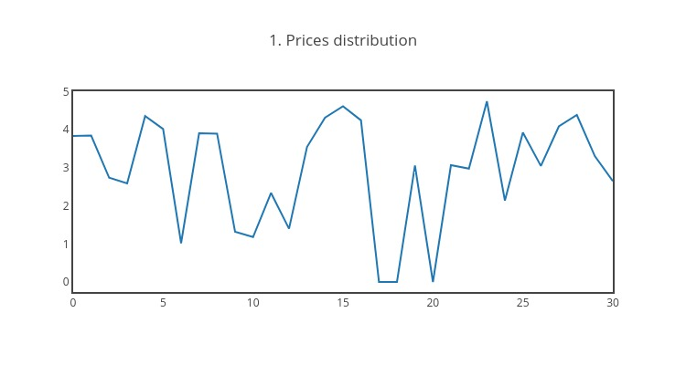

# prediction
Simple prediction model using regression and classification(All plots in plots folder)

              Задача

Есть история изменения стоимости клика за месяц по дням. Нужно
предложить модель (или использовать готовое решение) для
прогнозирования стоимостей на следующие 7 суток.
Для решения данной задачи была написана программа которая делает
предсказание при помощи алгоритмов ​ Random Forest Classifier ​ и ​ Random Forest
Regression​.
Вывод программы:

--------------- 1. Initial data ---------------

Baseline data available on link: https://plot.ly/~paulprokhorenko/8

--------------- 2. Univariate analysis of prices ---------------

Histogram of baseline data available on link: https://plot.ly/~paulprokhorenko/10
Central tendencies
Mean is: 2.7096774193548394
Median is: 2.7
Mode is: 0 0.0
dtype: float64
Min is: 0.0
Max is:4.99

--------------- 3. Correlation heat map ---------------

Heatmap of correlation between days available on link:
https://plot.ly/~paulprokhorenko/4
Dataframe what show vision of data by researcher:
Mon Tue Wed Thur Fri Sat Sun
Week 1: 4.37 3.88 1.04 3.44 1.07 4.99 1.97
Week 2: 3.02 0.00 4.19 3.76 3.65 4.73 2.56
Week 3: 4.89 4.49 1.32 0.00 2.78 2.04 3.18
Week 4: 2.70 1.60 2.20 1.00 2.45 1.34 4.40Correlation of above dataframe, it show relation of values between days:
Mon Tue Wed Thur Fri
Sat Sun
Mon 1.000000 0.899886 -0.706863 -0.279118 -0.400443 0.106747 -0.482009
Tue 0.899886 1.000000 -0.939446 -0.479181 -0.636169 -0.171982 -0.188786
Wed -0.706863 -0.939446 1.000000 0.457333 0.808235 0.251501 0.036519
Thur -0.279118 -0.479181 0.457333 1.000000 -0.091690 0.921056 -0.700739
Fri -0.400443 -0.636169 0.808235 -0.091690 1.000000 -0.172319 0.283676
Sat 0.106747 -0.171982 0.251501 0.921056 -0.172319 1.000000 -0.922233
Sun -0.482009 -0.188786 0.036519 -0.700739 0.283676 -0.922233 1.000000

--------------- 4. Predicted values by using Random Forest Classifier ---------------

Monday Tuesday Wednesday Thursday Friday Saturday Sunday
Predict
2.71 2.71 2.71 3.44 2.45 2.71 2.71

--------------- 5. Predicted values by using Random Forest Regression ---------------

Monday Tuesday Wednesday Thursday
Friday Saturday
Sunday
Predict 2.604391 2.736224
1.87165 2.763616 2.566987 2.456513 2.546413
Prediction results available on link: https://plot.ly/~paulprokhorenko/10
Examples of plots:

Вывод: так как используются случайные данные для предсказания, получаем и
соответственные результаты. Вероятней всего метод регрессии будет лучше для
небольшой выборки реальных данных, метод классификации может быть
актуален при большой выборке данных.
